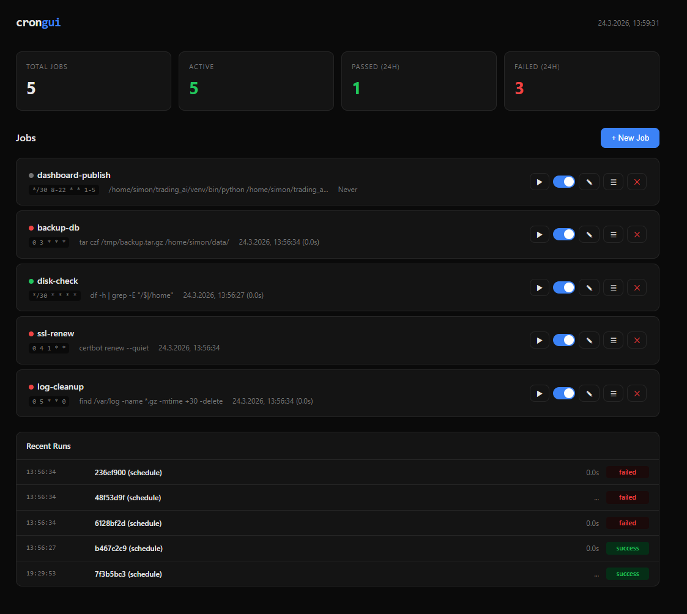
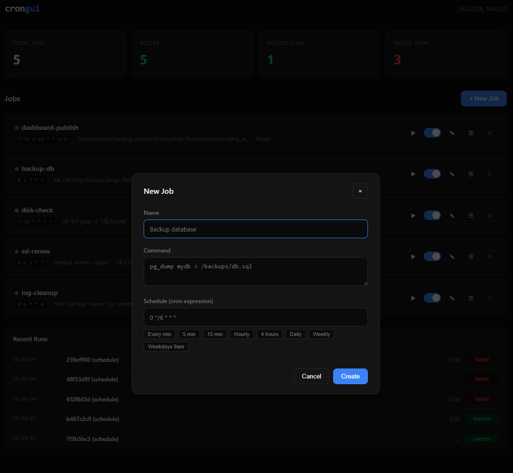

# crongui

Single-binary web UI for crontab. Wraps real crontab — no sync issues, no separate scheduler.



## Install

```bash
go install github.com/simonbleher/crongui@latest
```

Or grab a binary from [Releases](https://github.com/simonbleher/crongui/releases).

## Usage

```bash
# Start web dashboard
crongui serve --port 7272

# CLI
crongui list
crongui logs
```

Open `http://localhost:7272` to manage jobs.

## How it works

- **Real crontab**: Jobs are written directly to your crontab with marker comments (`# crongui:<id>`). No separate scheduler, no sync problems.
- **Output capture**: Each job runs through `crongui wrap` which captures stdout/stderr and exit codes to a local SQLite database.
- **Single binary**: Web UI is embedded via `go:embed`. No node_modules, no external dependencies. One binary, drop it on a server, done.

## Screenshots



## Run as service

```bash
# systemd
cat <<EOF | sudo tee /etc/systemd/system/crongui.service
[Unit]
Description=crongui
After=network.target

[Service]
ExecStart=/usr/local/bin/crongui serve --port 7272
Restart=on-failure

[Install]
WantedBy=multi-user.target
EOF

sudo systemctl enable --now crongui
```

## License

MIT
